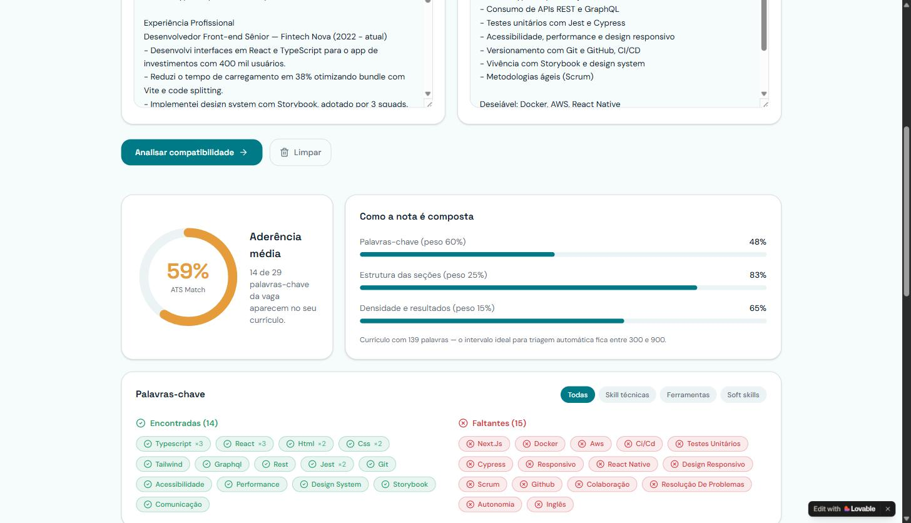
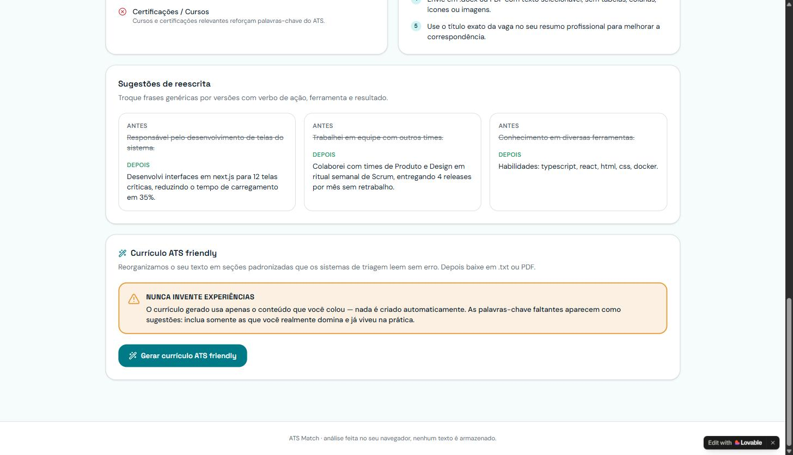
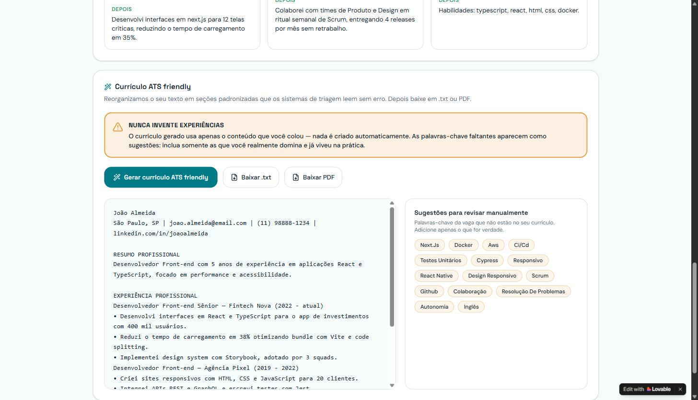

# 🎯 ATS Match — Otimizador de Currículo para ATS

Projeto criado no desafio **Criando um Gerador de Currículos ATS-Friendly com Lovable** da DIO (trilha Riachuelo — Criando Produtos com IA), construído do zero (sem repositório-base) com [Lovable](https://lovable.dev).

🔗 **Aplicação publicada:** https://ats-skill-spotter.lovable.app

---

## 📌 Qual problema o app resolve

Um currículo bom pode nunca chegar às mãos de um recrutador porque, antes disso, ele passa por um **ATS (Application Tracking System)** — o sistema que ranqueia e filtra candidatos automaticamente, comparando o texto do currículo com a descrição da vaga.

O **ATS Match** ataca esse problema: a pessoa cola a descrição da vaga e o próprio currículo, e a aplicação mostra, em segundos, o percentual de compatibilidade, quais palavras-chave da vaga já aparecem no currículo e quais estão faltando, além de gerar uma versão reescrita do currículo otimizada para passar por esses filtros — sempre reorganizando e reescrevendo apenas o que a pessoa realmente colou, nunca inventando experiência.

---

## 🧠 O mega prompt usado, e o que mudou até a versão final

O processo seguiu os 4 passos do desafio: escrever o mega prompt → gerar a primeira versão no Lovable → refinar → publicar.

### Mega prompt (versão final, colada no Lovable em modo Build)

```markdown
# App: ATS Match — Otimizador de Currículo para ATS

## Visão geral

Crie uma aplicação web chamada **ATS Match** que ajuda candidatos a passarem pelos sistemas de triagem automática (ATS — Application Tracking System) usados por empresas antes de um recrutador humano ler o currículo.

O núcleo funcional é:

1. A pessoa cola a **descrição da vaga** em um campo de texto.
2. A pessoa cola o **próprio currículo** (texto simples) em outro campo.
3. Ao clicar em "Analisar", a aplicação compara os dois textos e mostra:
   - Um **percentual de match** entre currículo e vaga.
   - As **palavras-chave da vaga encontradas** no currículo.
   - As **palavras-chave da vaga que faltam** no currículo.
4. A pessoa pode clicar em "Gerar versão ATS friendly", e a aplicação produz uma **versão ajustada do currículo**, reescrita para incorporar naturalmente as palavras-chave que faltavam, mantendo a formatação simples (sem tabelas, colunas ou ícones, que quebram a leitura de muitos ATS).
5. A versão ajustada pode ser exportada (botão "Exportar", formato texto/PDF).

## Regra inegociável (deve aparecer escrita na interface, de forma visível)

> A aplicação melhora **como a pessoa se apresenta**, mas **nunca inventa experiência, cargo, tempo de empresa, formação ou habilidade que a pessoa não tenha informado**. Toda reescrita usa só o conteúdo que a pessoa colou.

Essa regra deve aparecer como um aviso fixo perto da área de geração do currículo ajustado (não só em um rodapé discreto).

## Fluxo de telas

1. **Tela inicial / Landing** — título curto explicando o problema ("Seu currículo é bom, mas o ATS decide antes do RH.") e CTA para a tela de análise.
2. **Tela de Análise (core)** — dois campos de texto grandes lado a lado (empilham no mobile): "Descrição da vaga" e "Seu currículo", com botão "Analisar match" e placeholders de exemplo.
3. **Painel de Resultado** — percentual de match em destaque, duas listas de chips ("Palavras-chave encontradas" em verde e "faltando" em âmbar), botão "Gerar currículo ATS friendly" e o aviso fixo da regra inegociável.
4. **Painel do Currículo Ajustado** — área de texto com a versão reescrita, botão "Exportar" (PDF ou .txt) e botão "Analisar novamente".

## Design system e paleta

- **shadcn/ui** como design system base (Button, Card, Input/Textarea, Badge para as chips, Progress para o percentual de match, Tabs).
- Paleta: primária azul petróleo (`#0F5C5C`), sucesso verde suave (`#3FA796`) para palavras-chave encontradas, alerta âmbar (`#E8A33D`, nunca vermelho puro) para palavras faltando, fundo claro (`#FAFAF9`) com texto quase preto (`#1C1C1C`), contraste AA.
- Tipografia sem serifa, títulos semibold, tom visual profissional e calmo — "escritório moderno", não corporativo frio nem gamificado.

## Comportamento esperado da análise (lógica)

- Extrair termos relevantes da vaga (skills técnicas, ferramentas, certificações, soft skills explícitas).
- Comparar com o currículo (case-insensitive, considerando variações simples de plural/singular).
- Calcular o percentual de match como (nº de palavras-chave da vaga encontradas) / (nº total de palavras-chave da vaga).
- Na reescrita: incorporar termos que faltavam só quando fizer sentido semântico genuíno — nunca adicionar experiência, ferramenta ou responsabilidade que não estava implícita ou explícita no currículo original.

## Restrições técnicas

- 100% funcional no front-end para o MVP (lógica de texto simples, sem modelo de IA externo nesta versão).
- Responsiva (mobile e desktop).
- Sem login nem banco de dados — cada análise acontece só na sessão atual.

## O que NÃO fazer nesta primeira versão

- Não adicionar dashboard, histórico de análises ou autenticação ainda.
- Não inventar dados de exemplo que pareçam reais demais (vaga e currículo fictícios genéricos como placeholder).
```

### O que mudou depois da primeira geração

A primeira versão gerada pelo Lovable já entregou o núcleo funcional (as duas áreas de texto, o cálculo de match, os chips de palavras-chave encontradas/faltando e a geração do currículo ajustado). O pedido de refinamento feito depois, via chat, foi:

> *"Na tela do currículo ajustado, adicione a opção de baixar o resultado em PDF (além da opção existente de baixar em .txt). O PDF deve ter formatação limpa e compatível com ATS (títulos com linha, sem tabelas/colunas/ícones, texto selecionável) e destaque melhor o aviso 'Nunca invente experiências' — ele precisa chamar mais atenção do que um texto discreto."*

**Por que esse ajuste:** a exportação só em `.txt` deixava a pessoa sem uma opção pronta para anexar em vagas que pedem PDF, e o aviso ético da regra inegociável estava visualmente fraco demais para o peso que ele deveria ter na interface. O Lovable respondeu implementando os dois pontos: o currículo ajustado agora pode ser baixado em PDF (margens amplas, títulos com linha, acentos corretos) além do `.txt`, e o aviso "Nunca invente experiências" virou um card em destaque, com ícone e cor âmbar, posicionado logo acima do botão "Gerar currículo ATS friendly" — não mais em rodapé discreto.

---

## ⚙️ Como a análise funciona, da vaga colada ao currículo ajustado

1. **Entrada:** a pessoa cola a descrição da vaga e o próprio currículo (ou usa um dos exemplos prontos — "Desenvolvedor Front-end" ou "Product Designer" — para testar sem digitar nada).
2. **Extração de palavras-chave:** a aplicação identifica na vaga os termos relevantes — skills técnicas, ferramentas, metodologias e soft skills — e os classifica em categorias (Skills técnicas, Ferramentas, Soft skills).
3. **Comparação e pontuação:** o texto do currículo é varrido em busca dessas mesmas palavras-chave (case-insensitive). O score final ("Aderência média / ATS Match") é uma média ponderada de três fatores:
   - **Palavras-chave (peso 60%)** — proporção de termos da vaga encontrados no currículo;
   - **Estrutura das seções (peso 25%)** — presença de seções padrão que o ATS espera (Contato, Resumo, Experiência, Educação, Habilidades, Certificações);
   - **Densidade e resultados (peso 15%)** — se o currículo tem um volume de texto saudável (a aplicação sinaliza a faixa ideal, entre 300 e 900 palavras) e se traz resultados/métricas concretas.
4. **Resultado:** a tela mostra o percentual geral, o detalhamento de cada um dos três pesos, a lista de palavras-chave **encontradas** (chips verdes) e **faltantes** (chips âmbar), a checagem de estrutura do currículo e uma lista de recomendações práticas — além de sugestões de reescrita ("ANTES" → "DEPOIS") trocando frases genéricas por versões com verbo de ação, ferramenta e resultado.
5. **Geração do currículo ATS friendly:** ao clicar em "Gerar currículo ATS friendly", a aplicação reorganiza o texto original em seções padronizadas (Experiência Profissional, Formação Acadêmica, Habilidades) que sistemas de triagem leem sem erro — usando **somente** o conteúdo que a pessoa colou. As palavras-chave da vaga que ainda faltam aparecem à parte, como sugestões em "Adicione apenas o que for verdade", nunca inseridas automaticamente no texto.
6. **Exportação:** o currículo ajustado pode ser baixado em `.txt` ou em **PDF** com formatação limpa (sem tabelas, colunas ou ícones que confundem o ATS).

### Exemplo real testado (dado de exemplo pré-carregado no próprio app, "Desenvolvedor Front-end")



Com o currículo e a vaga de exemplo do próprio app, o resultado foi **59% de ATS Match** (14 de 29 palavras-chave), com o detalhamento: Palavras-chave 48% (peso 60%), Estrutura das seções 83% (peso 25%) e Densidade e resultados 65% (peso 15%).



As sugestões de reescrita trocam frases vagas como *"Responsável pelo desenvolvimento de telas do sistema"* por versões com verbo de ação, ferramenta e resultado, como *"Desenvolvi interfaces em next.js para 12 telas críticas, reduzindo o tempo de carregamento em 35%"* — usando dados que já estavam implícitos no currículo original, nunca inventados.



O currículo ATS friendly gerado reorganiza o conteúdo original em seções padronizadas e lista, à parte, as palavras-chave da vaga que ainda faltam (Next.js, Docker, AWS, CI/CD, Testes Unitários etc.) como sugestões para a pessoa avaliar se pode incluí-las — nunca como texto já inserido no currículo.

---

## 🚀 Aplicação publicada

**https://ats-skill-spotter.lovable.app** — publicada via Lovable (Publish), aberta para qualquer pessoa com o link, sem necessidade de login ou cadastro.

---

## 🛠️ Stack

Projeto gerado e mantido via [Lovable](https://lovable.dev), com sincronização bidirecional para este repositório GitHub. Para rodar localmente:

```bash
git clone https://github.com/wagms/ats-matcher.git
cd ats-matcher
npm i
npm run dev
```
